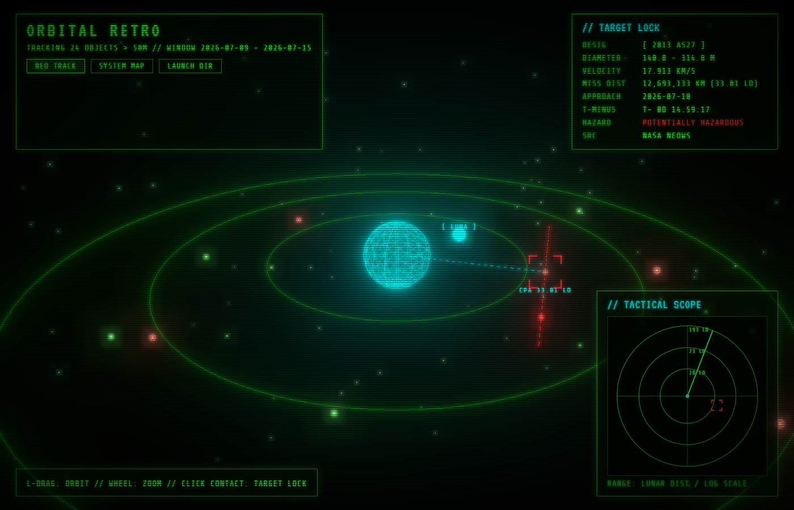
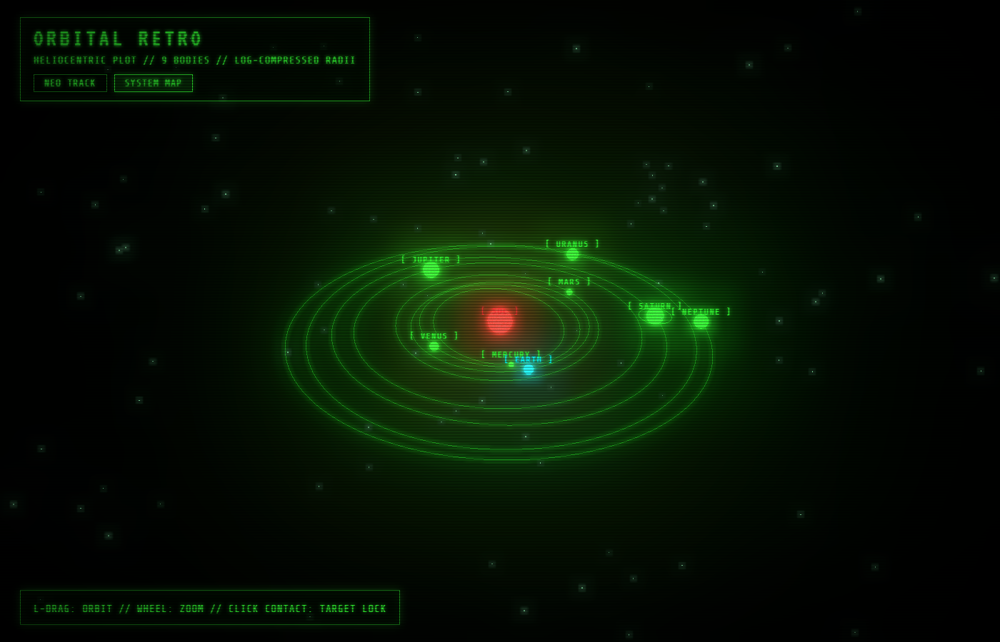
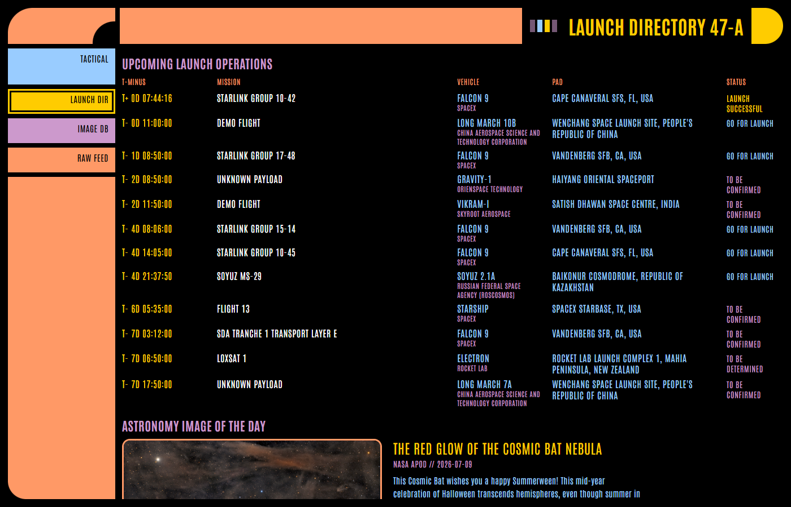

# Orbital Retro

A real-time space tracking dashboard in a 1970s/80s retro-futuristic shell:
Star Wars targeting-computer vectors for the tactical views, Star Trek LCARS
for the launch directory. All live data, no build step.

**Live: https://karanrp813.github.io/orbital-retro/** — self-updating daily
via GitHub Actions.

| NEO tracking | System map | Launch directory |
|---|---|---|
|  |  |  |

## Surfaces

| Page | Theme | Content |
|---|---|---|
| `index.html` | A — Targeting Computer | 3D NEO field (Three.js), tactical PPI radar, solar-system map |
| `launches.html` | B — LCARS | Upcoming launches with live countdowns, NASA APOD, raw feed viewer |

Deep links: `?lock=N` (pre-select NEO contact N), `?mode=system` (open the
system map), `launches.html#raw` (open the raw telemetry panel).

## Running

```
pip install -r requirements.txt
set NASA_API_KEY=...          # free key from https://api.nasa.gov (setx to persist)
python pipeline/refresh_all.py
python -m http.server 8000
# open http://localhost:8000
```

A Windows scheduled task ("Orbital Retro Data Refresh", daily 09:00) runs
`pipeline/refresh_all.py`; it logs to `data/refresh.log`.

## Data pipeline

| Script | Source | Output |
|---|---|---|
| `pipeline/fetch_neo_feed.py` | NASA NeoWs (needs `NASA_API_KEY`) | `data/neo_feed.json` |
| `pipeline/fetch_ephemeris.py` | JPL Horizons (keyless) | `data/ephemeris.json` |
| `pipeline/fetch_launches.py` | Launch Library 2 (keyless, ~15 req/hr free) | `data/launches.json` |
| `pipeline/fetch_apod.py` | NASA APOD (needs `NASA_API_KEY`) | `data/apod.json` |

`data/` is gitignored — regenerate it with `refresh_all.py` after cloning.

Note: the r/SpaceX API named in the original project doc has been frozen
since ~2022; Launch Library 2 is its maintained replacement and covers all
launch providers.

## Design contracts

- **SoA buffers**: `neo_feed.json` carries index-aligned flat numeric arrays
  (`buffers.*`, log-normalized 0-1) consumed directly as `Float32Array`
  shader attributes — one draw call for the whole asteroid field.
- **Ephemeris frame**: `ephemeris.json` is ecliptic AU; the frontend maps
  `(x, y, z) -> (x, z, -y)` and log-compresses radii per point.
- **Theme separation**: Theme A and LCARS never share a page (see
  `Claude_AstroTrack_Context.md` for the full aesthetic spec).
